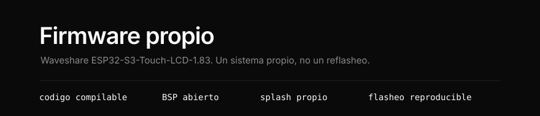

Construir un sistema **realmente open source** para esta placa
(Waveshare ESP32-S3-Touch-LCD-1.83), no solo reflashear binarios de terceros.

Este documento es el plan. El firmware, con su documentacion de uso, vive en
[`firmware/`](firmware/README.md).

Open source, en este contexto, significa: codigo compilable por terceros, BSP
abierto, splash propio y flasheo reproducible.

---

## Camino

| Camino | Que es | Resultado |
|---|---|---|
| A. Flashear Xiaozhi/Brookesia | Producto de otro | Rapido, poco propio |
| **B. ESP-IDF + BSP Waveshare + app propia** | **Sistema propio** | **Recomendado** |
| C. Desde cero sin BSP | Rehacer drivers | Muy lento, poco rentable |

Estado actual: **Camino B**.

Segun el objetivo: UI/companion propio empieza por B; asistente de voz primero
parte de Xiaozhi y adapta board y splash; los dos, base B mas un servicio de voz
separado.

---

## 0 · Red de seguridad

Hacer dump de particiones actuales antes de tocar nada (fuera de este repo). No
subir NVS/Wi-Fi ni binarios de terceros al Git.

Particiones observadas en fabrica:

```
bootloader        0x0        32 KB
partition table   0x8000      4 KB
otadata           0xF000      8 KB
model             0x12000   952 KB
factory           0x100000 4736 KB
ota_0             0x5A0000 6144 KB
storage           0xBA0000    resto
```

---

## 1 · Toolchain limpio

- Python 3.13
- ESP-IDF oficial 5.5.x (no vendor "dirty")
- target `esp32s3`, flash 16 MB (DIO/QIO 80 MHz), PSRAM octal OPI

**esptool.** ESP-IDF 5.5 trae la **4.12**. Los subcomandos con guion
(`write-flash`, `chip-id`) solo existen en esptool 5.x; usar siempre la forma con
guion bajo (`write_flash`, `chip_id`), valida en las dos.

**Windows.** El alias de Python de Microsoft Store se antepone al Python real y
hace fallar `install.bat` con error 49. Conviene desactivarlo en *Configuracion →
Aplicaciones → Alias de ejecucion de aplicaciones*.

Primero: compilar `idf.py hello_world`.

---

## 2 · Primer encendido util

Usar como referencia, no como repo final:

```
waveshareteam/ESP32-S3-Touch-LCD-1.83
ejemplos 01_AXP2101 y 02_lvgl_demo_v9
```

Meta: validar AXP2101, LCD 240x284, touch CST816 y backlight.

El panel es un **ST7789** (`esp_lcd_panel_st7789`). "ST7789P" es el nombre
comercial de Waveshare; no aparece como simbolo en el SDK ni en el binario.

---

## 3 · Estructura del repo

```text
firmware/
├── CMakeLists.txt
├── NOTICE
├── README.md
├── docs/{hardware.md,arquitectura.md,brand/}
├── partitions/default.csv
├── sdkconfig.defaults
├── main/            app_main, splash, pm, wifi, home, menu, rtc
├── components/
│   └── xpowerslib/  XPowersLib v0.3.3, vendorizada
├── assets/          splash.gif
└── scripts/         restore_factory.ps1, set_time.ps1
```

Los componentes propios `svc_*`, `shell` y `app_*` siguen planeados: hoy todo el
codigo del firmware vive en `main/`. Capas, reglas y contrato de apps en
[`firmware/docs/arquitectura.md`](firmware/docs/arquitectura.md).

`LICENSE` vive en la raiz del repositorio, no dentro de `firmware/`.

El manifiesto `idf_component.yml` va **dentro de `main/`**: pertenece al
componente, no al proyecto. Puesto al lado de `main/`, el Component Manager lo
ignora en silencio y el build falla despues con headers que no aparecen.

En Windows los scripts son `.ps1`. El flasheo de desarrollo es
`idf.py -p COM3 flash monitor`, y el dump de fabrica ya esta hecho, asi que
`scripts/` solo necesita la recuperacion.

Dependencias (`main/idf_component.yml`):

- `waveshare/esp32_s3_touch_lcd_1_83` `^2.0.0`
- `lvgl/lvgl` `^9` — pin obligatorio: el BSP declara `>=8,<10` y con LVGL 8 no
  existen `lv_display_t` ni `lv_screen_active()`
- el resto (`esp_lvgl_port`, `esp_codec_dev`, `esp_lcd_touch_cst816s`,
  `esp_lcd_panel_io_additions`) entra por transitividad del BSP

---

## 4 · Particiones propias (16 MB)

```
nvs        24K
otadata     8K
phy_init    4K
model     952K     reservada y vacia
factory     4M
ota_0       4M
assets     ~7M
```

`model` se reserva **vacia desde el dia 1**, aunque todavia no se use. Cambiar la
tabla de particiones mas adelante invalida OTA y borra la NVS de los equipos en
campo: el espacio se aparta ahora o la migracion es destructiva.

---

## 5 · Splash de arranque (app, no bootloader)

Orden para evitar pantalla negra larga:

```
I2C + AXP2101  ──►  panel + backlight  ──►  splash  ──►  WiFi, LVGL, audio, IMU
```

Evitar aislar USB-Serial-JTAG al inicio o en sleep para no perder el COM en
Windows.

---

## 6 · Flasheo de desarrollo

Durante prototipo, escribir solo bootloader + tabla + app en `factory`:

```bash
idf.py -p <PORT> flash monitor
```

Conservar `ota_0` como plan B hasta estabilizar `factory`. Evitar `erase_flash`
sin dump completo.

---

## 7 · Que tiene que incluir este repo

- codigo compilable en ESP-IDF 5.5
- `sdkconfig.defaults` + particiones
- guia de flash y recovery
- CI de `idf.py build`
- cero secretos, NVS o binarios de terceros

Esa es la definicion de "open source real" para este proyecto.
