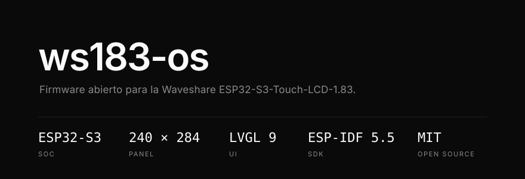
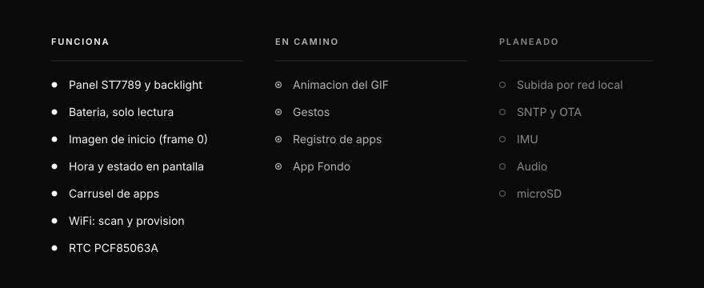
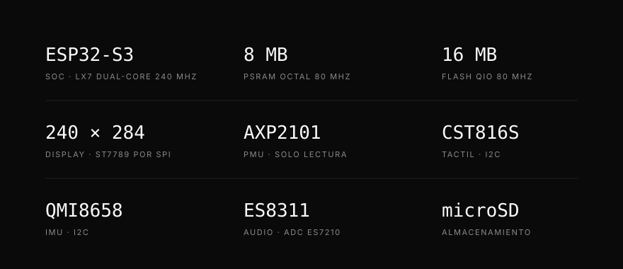
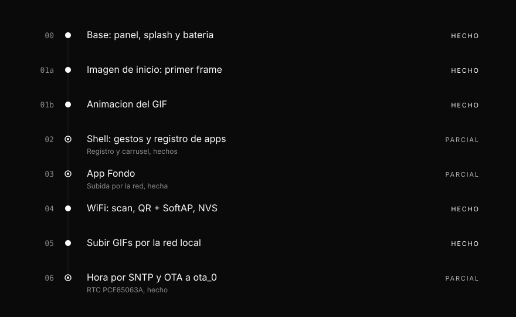

<div align="center">
  
</div>

Firmware abierto para la **Waveshare ESP32-S3-Touch-LCD-1.83**. Pantalla de inicio con
imagen propia, hora, estado de bateria y apps chicas. Construido sobre ESP-IDF oficial
y el BSP publicado por Waveshare: no es un fork del firmware de fabrica.

Clonar el repo, cambiar la imagen o los colores, agregar una app y flashear la placa.
Hecho para modificarse.

[Estado](#estado) · [Inicio](#pantalla-de-inicio) · [Hardware](#hardware) ·
[Energia](#energia) · [WiFi](#wifi) · [Compilar](#compilar) · [Flashear](#flashear) ·
[Hoja de ruta](#hoja-de-ruta)

---

## Estado



**Funciona** — panel ST7789 y backlight sin parpadeo al arrancar · bateria por AXP2101
en solo lectura · primer frame de `assets/splash.gif` como fondo · hora y estado en
pantalla · carrusel de apps con BOOT y tactil · WiFi con scan y provision por QR ·
RTC PCF85063A.

**En camino** — animacion del GIF · gestos · registro de apps · app *Fondo*.

**Planeado** — subida de GIFs por la red local · SNTP y OTA · IMU · audio · microSD.

Todo lo que este documento marca como *planeado* todavia no existe.

---

## Pantalla de inicio

```
┌──────────────────────────┐
│ 12:40:31    WiFi    87%  │   hora local, WiFi con IP, bateria
│                     USB  │   USB solo si hay VBUS
│                          │
│     [ splash.gif ]       │   frame 0: reducido, desenfocado
│                          │   y atenuado al 60 %
│                          │
└──────────────────────────┘
   BOOT (arriba)  →  carrusel de apps
   PWR  (abajo)   →  apaga por el AXP2101
```

El arranque dibuja primero un splash de texto y recien despues enciende la luz: el
primer frame visible nunca es un framebuffer sucio. Una task aparte monta `assets`,
decodifica el frame 0 de `splash.gif` y lo convierte en fondo; con eso, el splash de
texto deja lugar a la pantalla de inicio. Si falta el GIF, la pantalla de inicio se
dibuja igual, sin fondo.

La hora sale del RTC PCF85063A de la placa, con zona horaria UTC-3 fija. Si el RTC nunca
se puso en hora, el reloj muestra `--:--:--` y el resto sigue funcionando. Por USB:
`time` y `settime <epoch_utc>`, o [`scripts/set_time.ps1`](scripts/set_time.ps1).

BOOT abre el carrusel de apps —**Fondo**, **Aspecto**, **WiFi**, **Ajustes**— y otro
click lo cierra. Hoy solo **WiFi** hace algo; el resto avisa que viene. PWR apaga por el
AXP2101: el firmware no toca ese pin. Los gestos siguen siendo una propuesta.

Capas, reglas de hilos y el contrato de una app estan en
[`docs/arquitectura.md`](docs/arquitectura.md).

---

## Hardware



ESP32-S3 rev v0.2 en QFN56, PSRAM octal AP Memory 3V3 a 80 MHz y flash externa de 16 MB
(JEDEC `0x20` / `0x4018`). El panel es un `esp_lcd_panel_st7789` por SPI; el tactil, la
IMU, el PMU y el RTC cuelgan del mismo bus I2C.

Cada dato, con su procedencia —eFuse, boot log o binario— en
[`docs/hardware.md`](docs/hardware.md).

---

## Energia

```
AXP2101  ──►  pm_read()  ──►  pm_status_t  ──►  lv_timer  ──►  pantalla
   I2C        solo lectura     %, mV, VBUS      cada 3 s
```

El AXP2101 se inicializa en modo **solo lectura** despues del bus I2C. El firmware
habilita los ADC de medicion, pero no cambia tensiones, rieles, carga ni apagado. Si el
PMU no responde, el arranque continua y la pantalla muestra `sin PMU`.

```
100%            98% USB           3870 mV            sin bateria
porcentaje      cargando por      el PMU no pudo     no hay bateria
disponible      USB               estimar el %       conectada
```

El sufijo `USB` aparece en el splash de texto cuando el PMU informa carga; en la pantalla
de inicio el porcentaje y el indicador `USB` son dos etiquetas separadas, y `USB` se
enciende con VBUS presente. La tension medida siempre es un dato real, aunque el
porcentaje no se pueda estimar.

Tambien se registra una linea de telemetria con presencia, carga, porcentaje y las
tensiones de bateria, VBUS y sistema. Todavia no hay logica de carga ni de apagado.

---

## WiFi

El servicio inicia WiFi en modo STA despues del primer frame. Al abrir la card **WiFi**
del carrusel, ejecuta un scan asincrono y muestra hasta 16 redes cercanas, ordenadas por
RSSI. Los SSID repetidos se consolidan y se conserva la senal mas fuerte; las protegidas
llevan `*`. Las ocultas no se listan.

Tocar una red abierta conecta al toque. Tocar una red con clave abre un SoftAP
`ws183-XXXX` y un QR `WIFI:T:nopass;S:ws183-XXXX;;`. El celular se une al AP, el captive
portal pide la contrasena (el SSID ya esta elegido) y la placa conecta como STA. La clave
se guarda en NVS, namespace `wifi`; no se loguea. Al conseguir IP, el SoftAP se apaga y
la barra de inicio muestra **WiFi**.

BOOT o **Cerrar** corta el portal y vuelve al inicio. Si WiFi no pudo iniciar, la pantalla
muestra `WiFi no listo` y el resto del firmware sigue funcionando.

Por consola USB:

```
wifi                            estado STA/SoftAP y ultimo scan
wifiscan                        dispara un scan
wifiprov <ssid>                 abre SoftAP + portal para ese SSID
wificonnect <ssid> <pass>       conecta a una red con clave
wifidisconnect                  corta el STA y borra la NVS wifi
wifistop                        cierra el SoftAP
```

---

## Arquitectura

```
apps        fondo, wifi, ajustes ...           solo UI; no tocan hardware
  │
shell       inicio, gestos, barra de estado    navegacion y registro de apps
  │
servicios   pm, storage, wifi, time            hardware y estado; sin LVGL
  │
BSP         waveshare/esp32_s3_touch_lcd_1_83 + ESP-IDF 5.5
```

Cada capa solo conoce a la de abajo. Los servicios no incluyen `lvgl.h`; las apps no
incluyen drivers; nada opcional puede romper el arranque. Las reglas completas, con el
contrato de una app, estan en [`docs/arquitectura.md`](docs/arquitectura.md).

---

## Compilar

Requiere **ESP-IDF 5.5.x oficial**. No uses el arbol del vendedor: el firmware de fabrica
se compilo con un IDF marcado `-dirty`, que no es reproducible.

```
idf.py set-target esp32s3
idf.py build
```

Cada PR y cada push a `main` corren ese mismo `idf.py build` en GitHub Actions
([`.github/workflows/build.yml`](../.github/workflows/build.yml)), con ESP-IDF 5.5.1 fijo
y target `esp32s3`, contra `firmware/`. Parte de un clone limpio: sin `sdkconfig` local,
solo `sdkconfig.defaults` y `dependencies.lock`. No flashea ni prueba en placa; si una
dependencia no resuelve o el build se rompe, el PR queda en rojo antes de llegar a COM3.

El Component Manager baja el BSP y sus dependencias en el primer build. El manifiesto vive
en [`main/idf_component.yml`](main/idf_component.yml): pertenece al componente `main`, no
a la raiz del proyecto. Si se lo pone al lado de `main/`, el Component Manager lo ignora
en silencio y el build falla mas tarde con headers que no aparecen.

Versiones resueltas en el primer build verde:

| Componente | Version |
|---|---|
| `waveshare/esp32_s3_touch_lcd_1_83` | 2.0.0 |
| `lvgl/lvgl` | 9.5.0 |
| `espressif/esp_lvgl_port` | 2.9.0 |
| `espressif/esp_codec_dev` | 1.5.11 |
| `espressif/esp_lcd_touch_cst816s` | 1.1.2 |
| `espressif/esp_lcd_panel_io_additions` | 1.0.1 |

El pin `lvgl/lvgl: "^9"` no es opcional: el BSP declara `>=8,<10`, y con LVGL 8 no existen
`lv_display_t` ni `lv_screen_active()`.

**esptool.** ESP-IDF 5.5 incluye **esptool 4.12**. Los subcomandos con guion
(`write-flash`, `read-flash`, `chip-id`) solo existen en esptool 5.x. Este repo usa siempre
la forma con guion bajo (`write_flash`, `read_flash`, `chip_id`), que funciona en las dos.

---

## Flashear

> El primer `idf.py flash` **sobrescribe bootloader, tabla de particiones y `factory`**.
> Hace falta tener el backup de fabrica antes de correrlo.

```
idf.py -p COM3 flash monitor
```

Esperado en el monitor: log por USB-Serial-JTAG, `cpu freq: 240000000 Hz`,
`panel up: 240x284`, `AXP2101 inicializado`, `splash visible`,
`pantalla de inicio visible` y, poco despues, `wifi: STA up`. Si el log vive pero la
pantalla queda negra, el problema es backlight o PMU, no el USB.

`app_main` **retorna** despues de arrancar los servicios. No es un cuelgue: la task de
LVGL mantiene la pantalla, y el boton, la consola y WiFi siguen corriendo en las suyas.

Para probar WiFi: pulsa BOOT, abre la card **WiFi** y espera la lista de SSID con su RSSI.
Toca una red con clave y aparece el QR. En el celular, escanea, unete al AP `ws183-XXXX`,
pone la contrasena y volve a la placa. Otro click de BOOT, o **Cerrar**, vuelve al inicio.

Dos warnings del boot log son cosmeticos y esperados:

- `ledc: GPIO 40 is not usable, maybe conflict with others` — el backlight enciende igual.
- `i2c.master: Please check pull-up resistances whether be connected properly` — ESP-IDF
  lo imprime siempre que se crea un bus I2C sin la pull-up interna
  (`esp_driver_i2c/i2c_master.c`), y el BSP no la activa. No indica un bus colgado: el
  AXP2101 contesta en ese mismo bus justo despues.

---

## Personalizar

Lo que se puede cambiar hoy, sin tocar el resto del firmware:

| Que | Donde |
|---|---|
| Titulo y colores del splash | `boot_splash_show()` en [`main/boot_splash.c`](main/boot_splash.c) |
| Periodo de refresco de la bateria | `BATTERY_REFRESH_MS` en [`main/home_screen.c`](main/home_screen.c) |
| Escala, desenfoque y atenuado del fondo | `BG_SCALE_NUM`, `BG_BLUR_RADIUS` y `BG_DIM_PERCENT` en [`main/splash_gif.c`](main/splash_gif.c) |
| Apps del carrusel | `k_apps[]` en [`main/app_menu.c`](main/app_menu.c) |
| Brillo al arrancar | `bsp_display_brightness_set(80)` en [`main/app_main.c`](main/app_main.c) |
| Fuentes disponibles | `CONFIG_LV_FONT_MONTSERRAT_*` en [`sdkconfig.defaults`](sdkconfig.defaults) |

---

## Imagen de inicio

La imagen de inicio es **un GIF**, animado o de un solo frame: para cambiarla alcanza con
reemplazar un archivo, sin conversores. Vive en
[`assets/splash.gif`](assets/splash.gif) y se graba en la particion `assets`.

| | Regla |
|---|---|
| Formato | GIF, animado o de un frame |
| Tamano | hasta **240 px de ancho** y **284 px de alto**; no se escala en la placa |
| Opcional | si falta o no es valido, se ve la pantalla de inicio sin fondo |

Hoy se usa **el primer frame**: se decodifica una sola vez, se reduce a 3/5, se desenfoca
y se atenua al 60 %, y queda como fondo de la pantalla de inicio. La animacion completa
es la fase 1b, con decodificacion y PSRAM medidas en hardware. Limites, memoria y
secuencia de carga en [`docs/arquitectura.md`](docs/arquitectura.md#imagen-de-inicio).

Grabar la imagen en la placa:

```
idf.py -p COM3 assets-flash
```

Ese target lo crea `spiffs_create_partition_image(assets assets)` en
[`CMakeLists.txt`](CMakeLists.txt), declarado **sin `FLASH_IN_PROJECT`** a proposito: asi
`idf.py flash` no graba `assets` y un flash de desarrollo no borra las imagenes editadas
en la placa. Cada `idf.py build` regenera `build/assets.bin` aunque no lo grabe.

Como referencia visual, [`docs/esp32.gif`](docs/esp32.gif) es el ejemplo animado elegido.
Solo vive en la documentacion: no se empaqueta ni se reproduce en el ESP32. **No cumple
la regla de tamano**: mide 800x600. Para usarlo como `splash.gif` hay que exportarlo a
240 px de ancho; su contenido (552x538) queda en 240x234.

---

## Recuperacion

```
powershell -File scripts/restore_factory.ps1 -Port COM3
```

Restaura los 16 MB completos desde el backup de fabrica.

Mientras la placa siga con la tabla de particiones original, hay un atajo que vuelve al
demo sin reflashear nada:

```
python -m esptool --port COM3 erase_region 0xF000 0x2000
```

Eso deja `otadata` en blanco y el bootloader cae a `factory`. **Deja de servir despues del
primer flash con la tabla de este repo**, porque los offsets ya no coinciden.

---

## Si la placa no responde por USB

El firmware de fabrica aisla los GPIO en light sleep y el USB-Serial-JTAG deja de
contestar; Windows conserva el COM enumerado pero muerto (`ERROR_GEN_FAILURE` al abrir,
`ERROR_SEM_TIMEOUT` al escribir).

Manten apretado **BOOT (GPIO0)**, enchufa el USB, espera 2 s y solta: entra al ROM antes
de que corra el firmware.

Este repo apaga `CONFIG_PM_ENABLE`, asi que no hay light sleep automatico y el
USB-Serial-JTAG nunca se duerme.

La linea `sleep_gpio: Configure to isolate all GPIO pins in sleep state` **igual aparece**
en el boot log de este firmware. La emite `CONFIG_PM_SLP_DISABLE_GPIO`, que sigue
habilitada y solo deja preparada la configuracion por si hubiera un sleep; sin gestion de
energia no se dispara. Ver esa linea no significa que el COM se vaya a colgar.

---

## Particiones

Definidas en [`partitions/default.csv`](partitions/default.csv).

| Particion | Tipo | Offset | Tamano |
|---|---|---|---|
| `nvs` | data/nvs | `0x9000` | 24K |
| `otadata` | data/ota | `0xF000` | 8K |
| `phy_init` | data/phy | `0x11000` | 4K |
| `model` | data/spiffs | `0x12000` | 952K |
| `factory` | app | `0x100000` | 4M |
| `ota_0` | app | `0x500000` | 4M |
| `assets` | data/spiffs | `0x900000` | 7M |

`model` queda **reservada y vacia** desde el dia 1. No se usa todavia, pero cambiar la
tabla mas adelante invalida OTA y borra la NVS del campo, asi que el espacio se reserva
ahora.

`assets` guarda la imagen de inicio y, mas adelante, iconos y sonidos. En una placa que
nunca recibio `assets-flash`, esa zona (`0x900000`-`0xFFFFFF`) conserva restos de las
particiones de fabrica `ota_0` y `storage`, que la pisaban; por eso el firmware nunca
asume que monta ni que lo que lee es valido, y nunca formatea en silencio. El BSP monta
SPIFFS por etiqueta y su default es `storage`, por eso `sdkconfig.defaults` fija
`CONFIG_BSP_SPIFFS_PARTITION_LABEL="assets"`. El punto de montaje es el default del BSP,
`/spiffs`.

`nvs` guarda configuracion del usuario, hoy las redes WiFi. Nunca se versiona ni se vuelca
al repo.

---

## Hoja de ruta



- **00 · Base** — panel, splash y bateria en solo lectura. *Hecho.*
- **01a · Imagen de inicio** — primer frame de `splash.gif` desde `assets`, con la
  pantalla de inicio como respaldo si falta. *Hecho.*
- **01b · Animacion** — reproducir `splash.gif`, con decodificacion y PSRAM medidas en
  hardware. *Planeado.*
- **02 · Shell** — gestos, barra de estado y registro de apps. *Parcial:* la barra de
  estado y el carrusel existen; los gestos y `shell_register_app()` no.
- **03 · App Fondo** — elegir imagen, encuadrarla y dibujar encima. *Planeado.*
- **04 · WiFi** — scan, QR + SoftAP para la clave, recordar en NVS. *Hecho.*
- **05 · Transferencia local** — subir GIFs desde el celular por la red local. *Planeado.*
- **06 · Hora y OTA** — SNTP y actualizaciones OTA a `ota_0`. *Parcial:* el RTC
  PCF85063A ya da la hora; SNTP y OTA no existen.
- **CI** — cada PR corre `idf.py build` con ESP-IDF 5.5.1 contra `firmware/`. *Hecho.*

Mas adelante, sin orden fijo: IMU (girar la imagen, despertar al levantar), audio, microSD
y gestion de energia. La gestion de energia va ultima a proposito: el light sleep es lo
que colgaba el USB en el firmware de fabrica
(ver [Si la placa no responde por USB](#si-la-placa-no-responde-por-usb)).

---

## Contribuir

Issues y PRs son bienvenidos. Antes de abrir un PR:

- `idf.py build` pasa desde un clone limpio con ESP-IDF 5.5.x oficial.
- Una rama y un PR por cambio: `feat/...`, `fix/...`, `docs/...`.
- El arranque no depende de WiFi, de `assets` ni de la microSD. Si faltan, se ve la
  pantalla de inicio igual.
- Nada de secretos, credenciales WiFi, volcados de flash o NVS, ni binarios de terceros.
- El PMU sigue en solo lectura. Escribir rieles o configurar la carga va en un PR propio
  que justifique cada registro.
- Un dato de hardware nuevo va a [`docs/hardware.md`](docs/hardware.md), con su fuente.
- Una imagen o sonido nuevo va con su autor y su licencia en [NOTICE](NOTICE), y la
  licencia tiene que permitir redistribuirlo y modificarlo.
- Las credenciales WiFi viven en NVS (`wifi`); no se commitean ni se loguean. El SoftAP de
  provision es abierto y de corta vida: se apaga al conectar o al cerrar la pantalla.

Las reglas de codigo (servicios, apps, hilos y LVGL) estan en
[`docs/arquitectura.md`](docs/arquitectura.md).

---

## Licencia

Codigo propio bajo [MIT](../LICENSE). Atribuciones de terceros y de los recursos graficos
(autor y licencia de cada imagen) en [NOTICE](NOTICE).

Este repositorio no redistribuye binarios de Waveshare ni de Xiaozhi, ni volcados de flash
o NVS de la placa.
