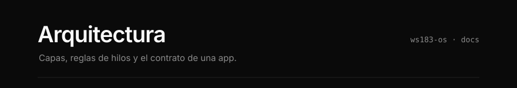

> **Diseno propuesto.** Este documento fija las reglas de capas, hilos y
> contratos. Si algo no cierra, se discute en un issue antes de programarlo.

[Capas](#capas) · [Reglas](#reglas) · [Arbol](#arbol-propuesto) ·
[Contrato de una app](#contrato-de-una-app) · [Servicios](#servicios-y-eventos) ·
[Imagen de inicio](#imagen-de-inicio)

---

## Capas

```
apps        fondo, wifi, ajustes ...           solo UI; no tocan hardware
  │
shell       inicio, gestos, barra de estado    navegacion y registro de apps
  │
servicios   pm, storage, wifi, time            hardware y estado; sin LVGL
  │
BSP         waveshare/esp32_s3_touch_lcd_1_83 + ESP-IDF 5.5
```

Cada capa solo conoce a la de abajo.

---

## Reglas

**1 · Los servicios no incluyen `lvgl.h`.** Exponen una API en C y publican sus
cambios por `esp_event`. Un servicio tiene que poder probarse sin pantalla.

**2 · Las apps no incluyen drivers.** Del BSP solo usan `bsp_display_lock()` y
`bsp_display_unlock()`. El resto lo piden a un servicio.

**3 · LVGL se usa desde un solo lugar a la vez.**

- Dentro de un `lv_timer` o de un evento de objeto LVGL, el codigo ya corre en la
  task de LVGL con el lock tomado: no hay que pedirlo.
- Desde cualquier otra task, incluido un handler de `esp_event`, se llama a LVGL
  solo entre `bsp_display_lock()` y `bsp_display_unlock()`.

**4 · Nada bloquea el primer frame.** El orden de `app_main` se mantiene: I2C,
PMU, panel, splash, backlight. Montar `assets`, la microSD o levantar WiFi viene
despues, y en su propia task si puede tardar.

**5 · Nada opcional rompe el arranque.** Sin `assets`, sin microSD, sin red o sin
PMU, la placa arranca igual: primero el splash de texto y despues la pantalla de
inicio, sin fondo si no hubo GIF usable.

**6 · Todo lo opcional se apaga por Kconfig**, en un menu `ws183-os` de
`idf.py menuconfig`. El build tiene que pasar con todas las apps apagadas.

---

## Arbol propuesto

```
firmware/
├── main/
│   ├── app_main.c          orden de arranque; registra servicios y apps
│   └── Kconfig.projbuild   menu ws183-os
├── components/
│   ├── svc_pm/             AXP2101 (hoy main/pm_axp2101.cpp)
│   ├── svc_storage/        monta assets y microSD
│   ├── svc_wifi/           escaneo, conexion y redes guardadas
│   ├── svc_time/           SNTP + RTC (hoy main/board_rtc_pcf85063.c)
│   ├── shell/              navegacion y registro de apps (hoy main/shell.c)
│   ├── app_fondo/          elegir, encuadrar y dibujar la imagen de inicio
│   └── app_wifi/           lista de redes y conexion
└── assets/                 contenido de la particion assets
```

Hoy todo vive en `main/`, incluido el shell: no hay `components/` propios
todavia. Los prefijos `svc_` y `app_` dicen a que capa pertenece cada componente
con solo leer el nombre. La mudanza a `components/` es un PR mecanico aparte, sin
cambios de comportamiento; mezclarla con logica nueva hace el diff imposible de
revisar.

`main/Kconfig.projbuild` ya existe, con una opcion por app. El build tiene que
pasar con todas apagadas: en ese caso el lanzador queda vacio y el resto del
firmware no se entera.

---

## Contrato de una app

Implementado en [`main/shell.h`](../main/shell.h) y [`main/shell.c`](../main/shell.c).

```c
typedef struct {
    const char *id;                /* "fondo": clave en NVS y prefijo de logs */
    const char *icon;              /* simbolo LVGL para la tarjeta */
    const char *name;              /* texto visible en el shell */
    void (*open)(lv_obj_t *root);  /* construye la UI dentro de root */
    void (*close)(void);           /* libera lo que no cuelga de root */
} os_app_t;

void shell_register_app(const os_app_t *app);
void shell_close_app(void);
```

- El registro es explicito, desde `app_main.c` y detras de su opcion de Kconfig.
  Sin trucos de linker: quien lee `app_main.c` ve todo lo que arranca.
- El shell llama a `open` y `close` desde la task de LVGL, con el lock tomado.
- Todo objeto que crea la app cuelga de `root`, y el shell borra `root` al salir.
  Los `lv_timer` no dependen de ningun objeto: la app los guarda y los borra en
  `close`, o siguen corriendo contra objetos que ya no existen.
- **La app no sabe quien la presenta.** No conoce el lanzador, ni la capa de LVGL
  en la que vive, ni el fondo del `root`: eso lo pone el shell. Para irse llama a
  `shell_close_app()`, que es lo mismo que si el usuario apretara BOOT.
- Con `open == NULL` la tarjeta aparece en el lanzador pero no abre nada. Es como
  entran las fases de la hoja de ruta que todavia no existen.

### Navegacion

```
inicio  --BOOT-->  lanzador  --toque-->  app
   ^                   |                  |
   +-------BOOT--------+--------BOOT------+
```

BOOT siempre significa atras. El lanzador y el `root` de la app viven en
`lv_layer_top()`, asi que la pantalla de inicio sigue abajo con su reloj
corriendo y no hay que reconstruirla al volver.

Las transiciones las anima el shell; las apps no. La duracion y la curva son
tokens de [`ui_theme.h`](../main/ui_theme.h), y mientras una transicion corre el
shell ignora BOOT y los toques.

---

## Servicios y eventos

```c
ESP_EVENT_DECLARE_BASE(SVC_PM_EVENT);

typedef enum {
    SVC_PM_EVENT_STATUS,           /* payload: pm_status_t */
} svc_pm_event_t;
```

Hoy `boot_splash.c` y `home_screen.c` leen el AXP2101 por I2C desde un
`lv_timer`, o sea dentro de la task de LVGL. Para v0 alcanza. Con mas servicios,
una transaccion I2C lenta frena el render. En la fase 2, `svc_pm` sondea desde su
propia task y publica `SVC_PM_EVENT_STATUS`; la barra de estado lo escucha y
actualiza la etiqueta entre lock y unlock (regla 3).

Para WiFi, ESP-IDF ya publica `WIFI_EVENT` e `IP_EVENT`. `svc_wifi` agrega la
lista del ultimo escaneo, el SoftAP de provision y las redes guardadas. Las
credenciales viven en NVS (`wifi`) y nunca en el repo.

### Portal de clave (celular)

El QR `WIFI:` solo une el celular al SoftAP. Un solo cliente a la vez
(`max_connection = 1`; cualquier otra MAC se desasocia). Cuando asocia, la
placa muestra su MAC y pide Si/No (30 s visibles; No lo desasocia). Recien
con Si se genera el segundo QR (`http://192.168.4.1/`). Hasta entonces el
HTTP del portal responde que hay que esperar en la placa y recarga cada 2 s.

Ese formulario **no redirige**. El submit es `fetch POST /connect` (JSON) y la
misma pagina queda en carga: un JS pregunta `GET /status` hasta `up` o `fail`.
`/status` lee `svc_wifi_link()`. El SoftAP no se apaga al primer `GOT_IP`: si
se corta ahi, el celular pierde la pagina antes de ver el resultado. Lo baja
la UI de la placa al cerrar, unos segundos despues de conectar.

No hay teclado en la placa. Redes abiertas no se conectan.

---

## Imagen de inicio

**Decision:** la imagen de inicio es un GIF, `/spiffs/splash.gif`, reproducido con
`lv_gif` de LVGL. Quien quiera cambiarla reemplaza un archivo; no hay conversor en
el camino. Una imagen estatica es un GIF de un solo frame.

Todo lo que sigue se verifico contra LVGL 9.5.0 y esp_lvgl_port 2.9.0, las
versiones de `dependencies.lock`.

### Reglas del archivo

| | Limite | Por que |
|---|---|---|
| Formato | `GIF87a` o `GIF89a` | lo que abre `lv_gif` |
| Ancho | <= 240 px | es el ancho del panel. `lv_gif` acepta hasta 480 (`MAX_WIDTH` en `AnimatedGIF.h`) pero no se escala en la placa: reescalar cada frame en software cuesta CPU |
| Alto | <= 284 px | es el alto del panel |
| Tamano del archivo | <= 1 MB (`SPLASH_MAX_BYTES`) | el archivo entero se carga en PSRAM |
| Presencia | opcional | si falta o no valida, queda la pantalla de inicio sin fondo (regla 5) |

Comportamiento heredado de AnimatedGIF, la libreria que usa `lv_gif`:

- Un frame con delay de 0 o 1 centesima se muestra 100 ms (`gif.c`).
- Sin bloque `NETSCAPE2.0`, la animacion se reproduce una sola vez y se detiene.
  Con loop 0 se repite siempre.
- La transparencia sale como alfa 0 **solo en ARGB8888**. En RGB565, el indice
  transparente se pinta con el color de fondo del GIF.

### Memoria

| | Maximo | Donde |
|---|---|---|
| Archivo GIF | limite de tamano (1 MB) | PSRAM; se libera apenas queda armado el fondo |
| Framebuffer de `lv_gif` | 240x284x4 = 272 KB en ARGB8888 | PSRAM |
| Estado de AnimatedGIF | unos 24 KB, dentro del objeto | PSRAM |
| Fondo derivado | 3/5 del frame, ARGB8888 | PSRAM; vive con la pantalla de inicio |

El framebuffer se pide en `LV_COLOR_FORMAT_ARGB8888` con
`lv_gif_set_color_format()` **antes** de `lv_gif_set_src()`. Duplica la memoria
frente a RGB565 (136 KB) y se paga a proposito: es el unico formato en el que
`lv_gif` deja el indice transparente del GIF como alfa 0, y sin eso el fondo
llega con el color de relleno pegado.

### Configuracion necesaria

Ya esta puesta en [`sdkconfig.defaults`](../sdkconfig.defaults):

- `CONFIG_LV_USE_CLIB_MALLOC=y`. Con el malloc propio de LVGL rige
  `CONFIG_LV_MEM_SIZE_KILOBYTES=64` sin expansion: el objeto `lv_gif` ya incluye
  el estado del decodificador (`GIFIMAGE`, unos 24 KB) y el framebuffer no entra.
  Con el malloc de C y `CONFIG_SPIRAM_USE_MALLOC=y`, los pedidos de mas de 16 KB
  (`CONFIG_SPIRAM_MALLOC_ALWAYSINTERNAL`) se sirven primero desde PSRAM.
- `CONFIG_LV_USE_GIF=y`.
- `CONFIG_BSP_SPIFFS_PARTITION_LABEL="assets"`, porque el default del BSP es
  `storage`.
- `CONFIG_BSP_SPIFFS_FORMAT_ON_MOUNT_FAIL` queda en `n`. En una placa que nunca
  recibio `assets-flash`, la zona de `assets` tiene restos del firmware de
  fabrica; formatearla en silencio borraria sin avisar lo que el usuario haya
  grabado si el mount falla por otra causa.

El GIF se lee con `fopen` y se entrega en memoria: no hace falta un driver de
archivos de LVGL.

### Fase 1a: primer frame estatico

Implementada en [`main/splash_gif.c`](../main/splash_gif.c). Asi funciona hoy:

1. `app_main` dibuja el splash de texto y enciende la luz. No se agrega nada antes
   del primer frame (regla 4).
2. Una task propia (`splash_gif`, 8 KB de stack, prioridad 2), **fuera** del lock
   de LVGL:
   - monta `assets` con `esp_vfs_spiffs_register()` y
     `format_if_mount_failed = false`. **No** usa `bsp_spiffs_mount()`: con
     `CONFIG_BSP_ERROR_CHECK=y` un mount fallido llama a `abort()`, y una
     particion vacia o con restos de fabrica (`SPIFFS_ERR_NOT_A_FS`, -10025)
     dejaria la placa en un loop de reinicios;
   - `stat()` de `/spiffs/splash.gif` y control del limite de tamano;
   - lectura completa a un buffer en PSRAM;
   - validacion de la cabecera a mano: firma de 6 bytes y ancho y alto en los
     bytes 6..9, little-endian, dentro de los limites.
3. Con `bsp_display_lock()` tomado:
   - `lv_gif_create()` oculto y `lv_gif_set_color_format(gif, ARGB8888)`;
   - `lv_gif_set_src(gif, &dsc)`, con un `lv_image_dsc_t` estatico que apunta al
     buffer. `lv_gif` guarda los punteros sin copiar: `dsc` y el buffer tienen que
     vivir tanto como el objeto, asi que `dsc` no puede estar en el stack. Esta
     llamada **decodifica el frame 0 y ademas arranca el timer** de la animacion;
   - `lv_gif_pause(gif)` en la misma seccion bloqueada: el timer no llega a correr;
   - si `lv_gif_is_loaded(gif)` es falso: borrar el objeto, liberar el buffer y
     seguir sin fondo.
4. Sin el lock, porque el objeto esta oculto y en pausa y nadie escribe su
   framebuffer: el frame 0 se reduce a 3/5 por promedio de area con alfa
   premultiplicado, se desenfoca con un blur de caja separable de radio 3 y se
   atenua al 60 %. Sale un `lv_draw_buf_t` ARGB8888 nuevo.
5. Se borra el `lv_gif`, se libera el archivo y, con el lock tomado, el splash de
   texto deja lugar a la pantalla de inicio, que recibe ese fondo.

La decodificacion del frame 0 ocurre con el lock tomado y frena el render mientras
dura. El log informa cuanto tardaron la decodificacion y el proceso, y cuanto
stack sobro.

Evitar:

- **`lv_gif_get_size()`:** declara un `GIFIMAGE` de unos 24 KB en el stack de quien
  lo llama (la task de LVGL tiene 7168 B, `ESP_LVGL_PORT_INIT_CONFIG`) y abre el
  archivo por el sistema de archivos de LVGL. La cabecera se valida a mano.
- **Rutas de LVGL (`"S:/splash.gif"`):** `lv_gif` leeria la flash en cada frame,
  dentro de la task de LVGL.

### Fase 1b: animacion

Planeada. Cuando se implemente:

- La animacion arranca con `lv_gif_resume()` cuando el arranque termino. **No con
  `lv_gif_restart()`:** fuerza `loop_count = -1`, y la animacion se detiene al
  completar una vuelta.
- Antes de dejarla activa por defecto se mide en hardware: tiempo por frame de
  `GIF_playFrame` (corre en la task de LVGL, asi que un frame lento demora el
  tactil), PSRAM libre antes y despues
  (`heap_caps_get_free_size(MALLOC_CAP_SPIRAM)`) y cuadros por segundo reales.
- **Al cambiar de pantalla, el objeto se borra** con `lv_obj_delete()`. Su
  destructor cierra el decodificador, libera el framebuffer y borra el timer. El
  buffer del archivo es nuestro: lo libera un handler de `LV_EVENT_DELETE`.
- `lv_gif_set_auto_pause_invisible(gif, true)` sirve solo de red de seguridad:
  pausa si la pantalla del GIF no es la activa, pero **no reanuda sola** y no
  libera memoria.

### Guardado seguro

Aplica cuando la placa escribe `splash.gif`: subida desde el celular (fase 5) o
copia desde la microSD. En SPIFFS, `rename()` **falla si el destino ya existe**
(`SPIFFS_ERR_CONFLICTING_NAME` en `SPIFFS_rename`), asi que el truco de escribir un
temporal y renombrarlo encima no alcanza:

1. se escribe `splash.new` completo, se cierra y se valida con las reglas de arriba;
2. se borra `splash.gif`;
3. se renombra `splash.new` a `splash.gif`.

Al arrancar, si falta `splash.gif` pero existe un `splash.new` valido, se termina el
paso 3. Un corte de energia en cualquier punto deja el GIF viejo, el nuevo o ningun
GIF, nunca un archivo a medias.

### Consecuencias para la fase 3

La placa no tiene codificador de GIF, asi que la app *Fondo* **no reescribe el
archivo**:

- encuadrar es guardar un desplazamiento en NVS y aplicarlo a la posicion del objeto;
- dibujar encima es una capa aparte, guardada en su propio archivo;
- el zoom usaria `lv_image_set_scale()`, que escala cada frame en software. Queda
  sujeto a la medicion de la fase 1b.

### Grabado desde la PC

```
idf.py -p COM3 assets-flash
```

Ese target lo crea `spiffs_create_partition_image(assets assets)` en
[`CMakeLists.txt`](../CMakeLists.txt), declarado sin `FLASH_IN_PROJECT` para que
`idf.py flash` no pise lo grabado en la placa
(ver [README](../README.md#imagen-de-inicio)).
